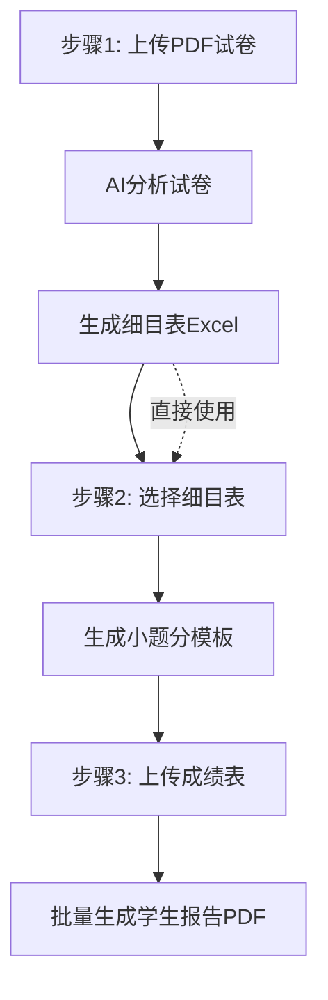

# 初中科学试卷分析系统

一个功能完整的试卷分析解决方案，支持从 PDF 试卷自动生成细目表、小题分模板、以及学生个人分析报告。

## 功能特性

### 核心功能

- **PDF 解析**：自动提取试卷内容，支持本地 Node.js 环境
- **AI 细目表生成**：通过 OpenAI 兼容 API 自动分析试卷内容，生成标准化的细目表
- **小题分模板**：根据细目表自动生成可填写的小题分 Excel 模板
- **批量报告生成**：根据学生成绩批量生成个人分析报告 PDF
- **多 API 支持**：支持 OpenAI、Claude 等 OpenAI 兼容接口

### 工作流程



## 系统要求

- **操作系统**：Windows 10/11 (x64)、统信UOS 20/23、Linux
- **内存**：建议 8GB 及以上
- **磁盘**：至少 500MB 可用空间
- **网络**：需要互联网连接（用于 AI API 调用）

## 安装与运行

### Windows

#### 方式一：直接运行（开发模式）

```powershell
cd main
python -m venv .venv
.\.venv\Scripts\Activate.ps1
pip install -r requirements.txt
python main.py
```

#### 方式二：打包成 EXE

```powershell
cd main

# 清理旧构建（可选）
Remove-Item -Recurse -Force build, dist, .venv -ErrorAction SilentlyContinue

# 打包（目录模式）
.\build_exe.ps1

# 或打包为单文件 EXE（启动较慢）
.\build_exe.ps1 -OneFile
```

打包完成后：

- 目录模式：`dist\ScoreReportTool\` 文件夹
- 单文件模式：`dist\ScoreReportTool.exe`

**注意**：运行打包后的程序时，`node` 文件夹必须与 EXE 在同一目录下。

### Linux / 统信UOS

统信UOS基于Linux内核，本程序完全兼容。以下是在统信UOS上运行的详细步骤：

#### 1. 快速配置（推荐：一键安装）

项目提供了自动化配置脚本，可一键安装所有依赖：

```bash
# 克隆或下载项目后，进入项目目录
cd ~/score-analyzer-full

# 添加执行权限并运行一键配置
chmod +x uos_auto_prepare.sh
./uos_auto_prepare.sh
```

脚本会自动完成以下操作：

- 检测系统架构（x86_64 / aarch64），下载对应版本的 Miniconda
- 创建 Python 虚拟环境 `pyside6_env`
- 安装 PySide6 及所有项目依赖
- 下载并配置 Node.js（根据架构选择 x64 或 arm64 版本）
- 安装 mineru-open-api（PDF 解析必需）
- 验证所有组件是否安装成功

> ⚠️ 安装过程需要网络连接，请确保能够访问清华 pip 镜像源。

配置完成后，每次使用前运行：

```bash
conda activate pyside6_env
python3 main.py
```

---

#### 2. 手动配置（传统方式）

如果上述一键脚本无法在你的系统上运行，可以手动按以下步骤配置：

##### 2.1 安装系统依赖

打开终端，安装Python和pip（如果尚未安装）：

```bash
# 统信UOS商店中搜索"Python"安装，或使用命令安装
sudo apt update
sudo apt install python3 python3-pip python3-venv
```

##### 2.2 下载并配置项目

```bash
# 克隆或下载项目
cd ~/下载  # 或你存放项目的目录
# 如果从GitHub下载，解压后进入main目录

# 创建虚拟环境
python3 -m venv .venv
source .venv/bin/activate

# 安装Python依赖
pip install -r requirements.txt
```

##### 2.3 配置Node.js（PDF解析必需）

PDF解析功能需要Node.js环境。运行自动配置脚本：

```bash
cd node

# 给脚本添加执行权限
chmod +x setup_node_linux.sh

# 运行脚本（会自动下载Node.js和mineru-open-api）
./setup_node_linux.sh
```

脚本会自动完成：

- 检测系统架构（x86_64 / aarch64），下载对应版本的 Node.js
- 解压到 `node/node-v20.10.0-linux-x64/` 或 `node/node-v20.10.0-linux-arm64/`
- 安装 mineru-open-api

##### 2.4 运行程序

```bash
cd ..
source .venv/bin/activate
python3 main.py
```

#### 3. 注意事项

- **PDF解析**：必须先配置Node.js环境（一键脚本已包含，或手动运行 `node/setup_node_linux.sh`）
- **API配置**：首次使用需要在程序中配置AI接口地址和密钥
- **输出路径**：生成的Excel和PDF文件默认保存在用户目录

#### 4. 常见问题

**Q: 提示"Node.js not found"**

- 确保已运行一键配置脚本或 `node/setup_node_linux.sh`
- 确保程序目录下有 `node/node-v20.10.0-linux-x64/` 或 `node/node-v20.10.0-linux-arm64/` 目录

**Q: 图形界面无法启动**

- 确保已安装PySide6：`pip install PySide6`
- 检查系统是否支持Qt图形环境

**Q: 可执行文件格式错误**

- 这通常是架构不匹配问题，请确保运行配置脚本自动检测并安装正确架构的Node.js

## 使用说明

### 首次配置

1. 启动程序后，切换到「接口配置」标签页
2. 填写 API 地址（例如：`https://api.openai.com/v1/chat/completions`）
3. 填写 API 密钥
4. 选择或输入模型名称（如 `gpt-4`、`gpt-3.5-turbo`）
5. 设置超时时间（默认 120 秒）
6. 点击「保存配置」

### 完整工作流

#### 步骤 1：生成细目表

1. 在「完整工作流」标签页中
2. 点击「选择 PDF 文件」，选择要分析的试卷
3. 点击「开始 AI 分析」，等待分析完成
4. 分析完成后，点击「保存细目表 Excel」下载细目表
5. 或者点击「直接使用细目表」跳过下载，直接进入步骤 2

#### 步骤 2：生成小题分模板

1. 点击「选择细目表」加载已有的细目表 Excel
2. 或使用步骤 1 生成的细目表（点击「直接使用细目表」）
3. 点击「生成小题分模板」
4. 选择保存位置，下载生成的模板文件

#### 步骤 3：批量生成学生报告

1. 使用步骤 2 生成的模板填写学生成绩
2. 点击「选择已填写成绩表」，加载填写好的成绩表
3. 点击「开始批量分析」
4. 等待所有报告生成完成
5. 点击「打开报告文件夹」查看生成的 PDF 报告

### API 配置说明

| 参数     | 说明                | 示例                                           |
| -------- | ------------------- | ---------------------------------------------- |
| API 地址 | OpenAI 兼容接口地址 | `https://api.openai.com/v1/chat/completions` |
| API 密钥 | 接口访问密钥        | `sk-xxxxxx`                                  |
| 模型     | 使用的 AI 模型      | `gpt-4`、`gpt-3.5-turbo`                   |
| 超时时间 | 请求超时时间（秒）  | `120`                                        |

## 项目结构

```
main/
├── main.py                    # 程序入口
├── build_exe.ps1              # Windows 打包脚本
├── uos_auto_prepare.sh        # UOS 一键环境配置脚本
├── requirements.txt            # Python 依赖
├── README.md                   # 本文档
│
├── app/                       # 应用模块
│   ├── __init__.py
│   ├── unified_app.py         # 统一 GUI 应用
│   ├── desktop.py             # 桌面模式（保留）
│   ├── ai_client.py           # AI API 客户端
│   ├── ai_service.py          # AI 服务封装
│   ├── analysis_service.py     # 分析服务
│   ├── config_service.py       # 配置管理
│   ├── excel_service.py        # Excel 处理
│   ├── exceptions.py           # 异常定义
│   ├── models.py              # 数据模型
│   ├── pdf_parser.py          # PDF 解析模块
│   └── pdf_service.py          # PDF 生成服务
│
├── tests/                     # 测试文件
│   └── test_core_services.py
│
└── scripts/                   # 构建脚本
    └── build_app.sh           # Linux 打包脚本

node/                          # Node.js 运行时（PDF 解析用）
├── node-v20.10.0-win-x64/     # Windows Node.js
├── node-v20.10.0-linux-x64/   # Linux x64 Node.js
├── node-v20.10.0-linux-arm64/ # Linux ARM64 Node.js
└── setup_node_linux.sh        # Linux Node.js 配置脚本
```

## 常见问题

### Q: 程序启动报错「缺少 PySide6」

```powershell
pip install -r requirements.txt
```

### Q: PDF 解析失败

1. 确保 `node` 文件夹与程序在同一目录
2. 确保 Node.js 可执行文件存在
3. 检查 `node/node-v20.10.0-linux-x64/node` 或 `node/node-v20.10.0-linux-arm64/node` 是否存在

### Q: AI 接口报错

1. 检查 API 地址是否正确
2. 检查 API 密钥是否有效
3. 检查网络连接是否正常
4. 尝试增加超时时间

### Q: 打包后程序无法运行

1. 确保 `node` 文件夹与 EXE 在同一目录
2. 确保所有依赖库已正确打包
3. 尝试以管理员权限运行

## 注意事项

1. **数据安全**：所有数据处理在本地完成，不会上传到服务器
2. **AI 分析**：生成结果建议人工审核确认
3. **PDF 解析**：依赖本地 Node.js 环境，需要预先安装 mineru-open-api
4. **报告生成**：支持的题型包括选择题、填空题、实验探究题、计算题

## 技术栈

| 类别       | 技术                      |
| ---------- | ------------------------- |
| GUI 框架   | PySide6                   |
| PDF 解析   | mineru-open-api + Node.js |
| AI 接口    | OpenAI 兼容 API           |
| Excel 处理 | pandas + openpyxl         |
| PDF 生成   | reportlab                 |
| 打包工具   | PyInstaller               |

## 许可证

本项目仅供学习交流使用。
